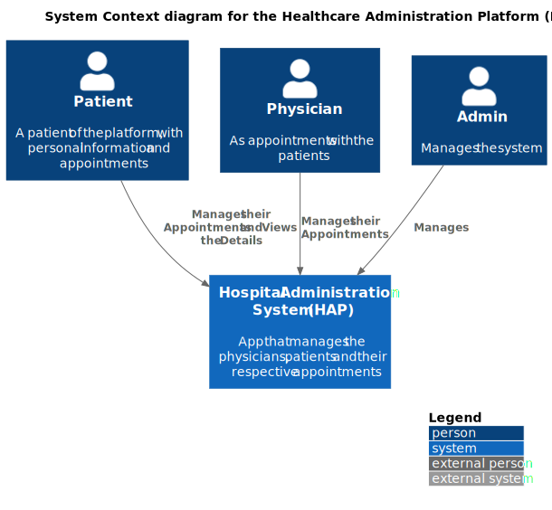
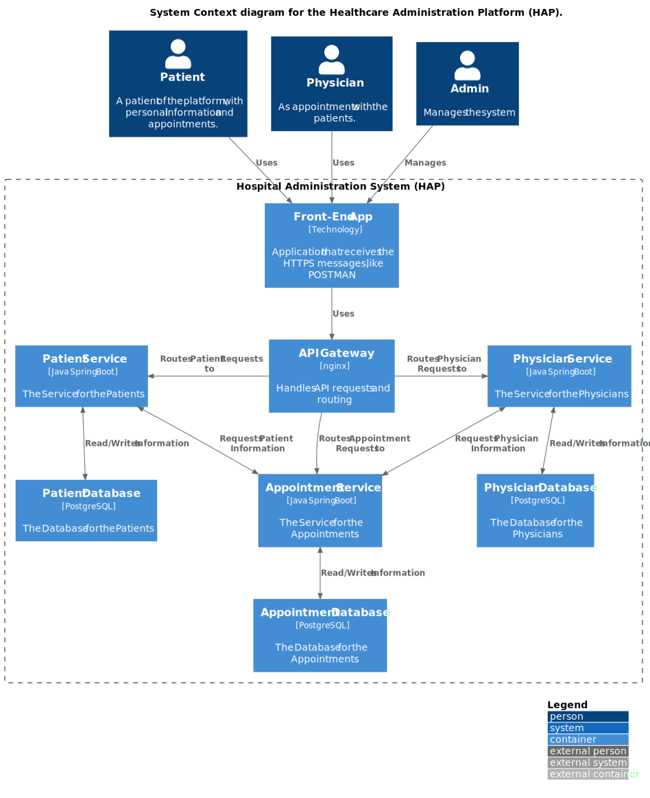
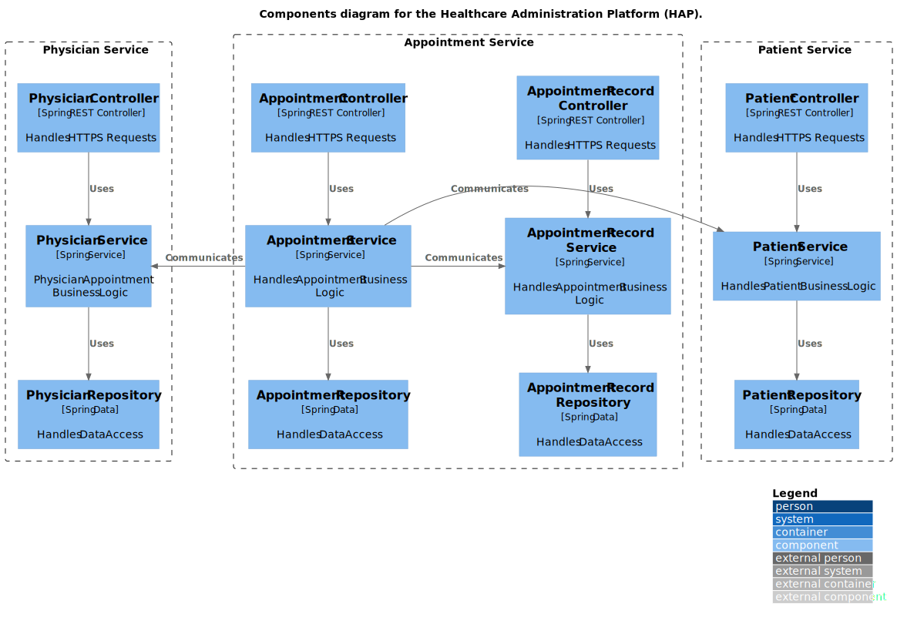
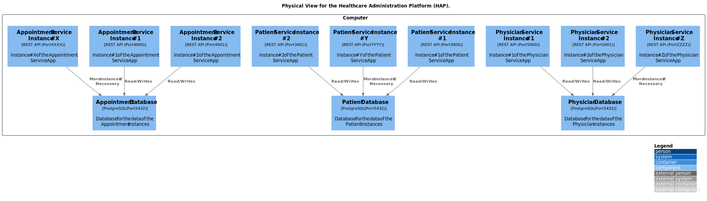
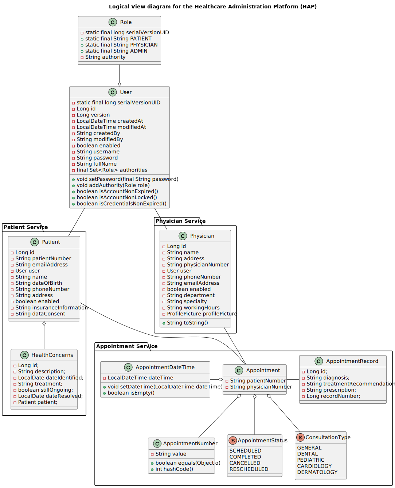
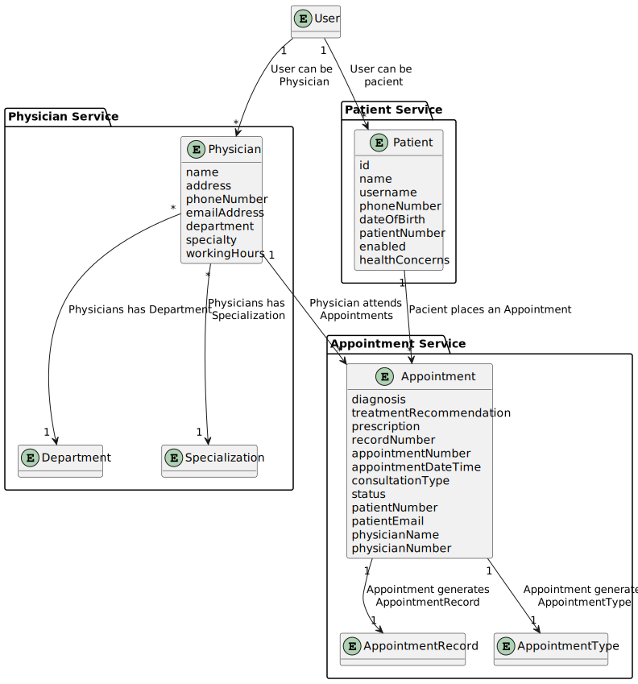

# SIDIS-3DB-G02

The main goal of this project is to turn the monolithic Healthcare Appointment Platform (HAP) project in a distributed system using the proper patterns and principals.

## Deployment Instructions
To deploy the HAP project, the user most have the following software and configurations in their system.

Docker: All the microservices and their dependencies are in containers that are managed by [Docker](https://www.docker.com/).

## C4

### C4 Level 1: System Context

**Actors:**
- Patient
- Physician
- Admin

**System:** HAP

**External Systems:** n/a

### C4 Level 2: Containers

### C4 Level 3: Components

## C4+1

### C4+1: Physical View

### C4+1: Logical View

### Domain Model

## Architectural Decisions

### Load Balancing

We decided to use nginx for the load balancing of the instances of a respective service, one of the reasons for that necessity is the fact that all the instances of the same service share the repository, so we want to make sure that none of the instances got overloaded. For more info see the [API Gateway](docs/Glogal_Artifacts/API_Gateway.md) document.

### Databases Engine

PostgreSQL was our choice for the database, it's open source and for our project it fit perfectly to have a shared databases between services.

### CQRS Pattern

We used the CQRS pattern only for the Physician Service. We decided that it was the best fit because the difference between read and write uses was significant, the number of times that it's need to consult a physician is greater than the times that a physician is added or dismissed.
For the appointment and patient services, we decided that using CQRS was unnecessary because the difference between write and read wasnt that great, and it would add more complexity to the system.

### Saga Pattern

### OBSERVABILITY

We use grafana labs solution for observability(Alloy, Loki and Tempo) and Prometheus. Access http://localhost:3030/ to see the dashboard, for more info see the [Observability](docs/Glogal_Artifacts/Observability.md) document.

## Quality Models

The quality model we used for HAP to guide us in the transition from monolith to distributed architecture was [FURPS+](docs/Glogal_Artifacts/FURPS.md) to ensure the quality, of the software and to help us guide through the implementation.

# Autoavaliação
### 1221412 - Vítor Barbosa

| Nome               | Número      | Nota |
|--------------------|-------------|------|
| Vítor Barbosa      | 1221412     | 14   |
| Carlos Oliveira    | 1220806     | 14   |
| Henrique Gonçalves | 1200968     | 14   | 

### 1220806 - Carlos Oliveira

| Nome               | Número      | Nota |
|--------------------|-------------|------|
| Vítor Barbosa      | 1221412     |      |
| Carlos Oliveira    | 1220806     |      |
| Henrique Gonçalves | 1200968     |      | 

### 1200968 - Henrique Gonçalves

| Nome               | Número      | Nota |
|--------------------|-------------|------|
| Vítor Barbosa      | 1221412     |      |
| Carlos Oliveira    | 1220806     |      |
| Henrique Gonçalves | 1200968     |      |