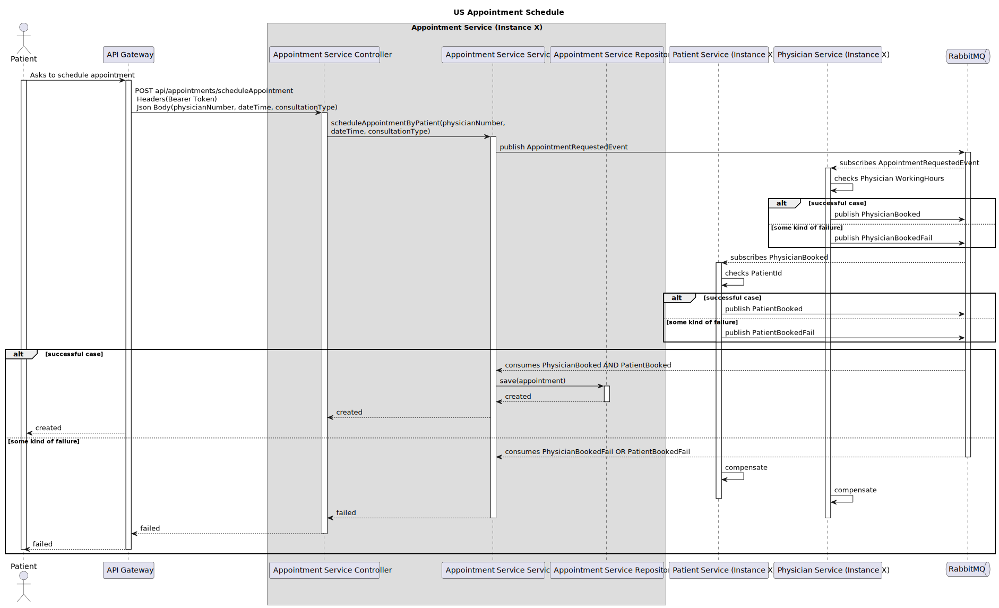

# US - Schedule Appointment

## 1. Requirements Engineering

### 1.1. User Story Description

As a Patient, I want to schedule an appointment.

### 1.2. Customer Specifications and Clarifications

**From the specifications document:**

n/a

**From the client clarifications:**

n/a

### 1.3. Acceptance Criteria

- 01: The physician must be in working hours.

### 1.4. Found out Dependencies

* No dependencies were found.

### 1.5 Input and Output Data

**Input Data:**

- Typed Data:

    - physicianNumber 
    - dateTime 
    - consultationType

- Login Info:

    - PatientID

**Output Data:**

- Success/Fail of the operation.

### 1.6. System Sequence Diagram (SSD)

### 1.7 Other Relevant Remarks

n/a

## 2. OO Analysis

### 2.1. Relevant Domain Model Excerpt

### 2.2. Other Remarks

- n/a

## 3. Design - User Story Realization

### 3.1. Sequence Diagram (SD)

### 3.2. Class Diagram (CD)

## 4. Tests

## 5. Integration and Demo

n/a

## 6. Observations

n/a